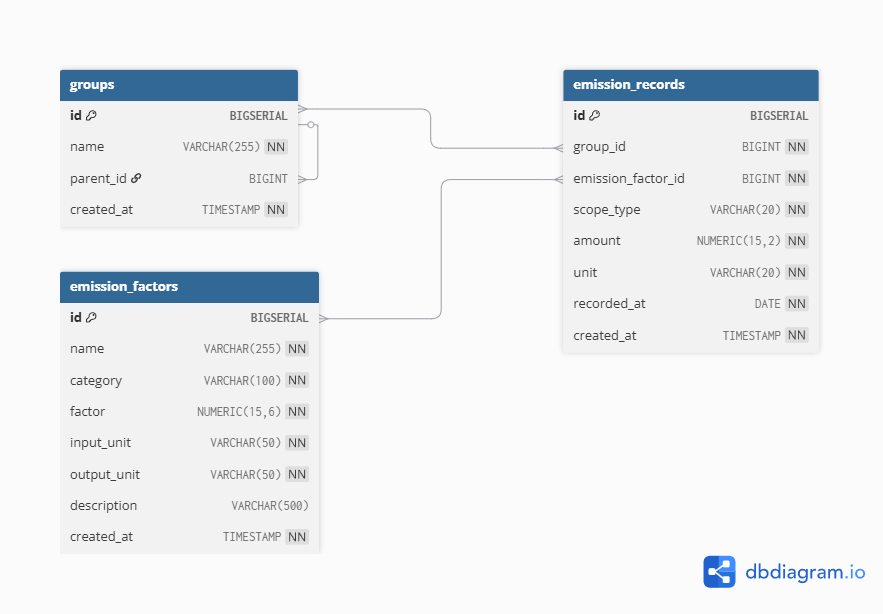

# HanaLoop Carbon Emission Dashboard

탄소 배출량 및 탄소세를 조직 계층 구조 기반으로 시각화하는 대시보드 프로젝트입니다.

기업의 조직 구조를 기준으로 Scope1 / Scope2 / Scope3 배출량을 집계하고, 관리자가 전체 배출 현황을 빠르게 파악할 수 있도록 설계되었습니다.

---

# Preview

* 조직 계층 관리 (Drill Down 구조)
* 전체 배출량 분석
* Scope별 배출량 분석
* 탄소 배출 레코드 CRUD
* 반응형 Dashboard UI
* Docker 기반 실행 환경
* Swagger(OpenAPI) 문서 지원

---

# Features

## 1. Dashboard

* 전체 탄소 배출량 집계
* Scope1 / Scope2 / Scope3 구분 시각화
* 그룹별 탄소 배출량 분석
* 배출량, 카드 UI 제공
* 조직 단위 Drill 구조 제공

## 2. Group Management
* 그룹 CRUD
* 그룹 목록 테이블

## 3. Emission Record Management

* 탄소 배출 데이터 CRUD
* Scope 수 분류
* 개별 레코드에 대한 목록 테이블

## 4. API Documentation

* OpenAPI(Swagger) 문서 제공
* Zod 기반 Validation
* API 타입 안정성 확보

## 5. Responsive UI

* Desktop / Tablet / Mobile 대응
* 카드 기반 Dashboard UI

---

# System Architecture

```txt
Client (Next.js)
    │
    ├── Dashboard UI
    ├── Group Management
    ├── Record Management
    │
    ▼
Next.js API Routes
    │
    ├── Validation (Zod)
    ├── Business Logic
    ├── CRUD Services
    │
    ▼
PostgreSQL
```

---

# Tech Stack

## Frontend

* Next.js (App Router)
* React
* TypeScript
* TailwindCSS
* TanStack Query
* React Hook Form

## Backend

* Next.js Route Handler
* PostgreSQL
* Drizzle ORM
* Zod
* Swagger(OpenAPI)

## DevOps

* Docker
* Docker Compose

---

# Database Design

ERD 다이어그램: [dbdiagram.io](https://dbdiagram.io/d/Hanaloop-6a1bc4582eeb2f46cd24aa70)



## groups

조직 계층 구조를 저장하는 테이블입니다.

```sql
CREATE TABLE groups (
    id BIGSERIAL PRIMARY KEY,
    name VARCHAR(255) NOT NULL,
    parent_id BIGINT REFERENCES groups(id),
    created_at TIMESTAMP NOT NULL DEFAULT NOW()
);
```

### Hierarchy Example

```txt
HanaLoop Holdings
├── Korea Branch
│   ├── Seoul Factory
│   │   ├── Line A
│   │   └── Line B
│   └── Busan Factory
└── Japan Branch
```

---

## emission_records

탄소 배출 데이터를 저장하는 테이블입니다.

```sql
CREATE TABLE emission_records (
    id BIGSERIAL PRIMARY KEY,
    group_id BIGINT NOT NULL REFERENCES groups(id),
    scope_type VARCHAR(20) NOT NULL,
    amount NUMERIC(15, 2) NOT NULL,
    unit VARCHAR(20) NOT NULL DEFAULT 'tCO2e',
    recorded_at DATE NOT NULL
);
```

---

# Carbon Emission Strategy

본 프로젝트는 Scope 기반 탄소 관리 방식을 사용합니다.

| Scope  | Description    |
| ------ | -------------- |
| Scope1 | 직접 배출          |
| Scope2 | 전력 사용 간접 배출    |
| Scope3 | 기타 공급망 및 간접 배출 |

---

# Folder Structure

```txt
app/
 ├── api/
 ├── groups/
 ├── records/
 └── page.tsx

components/
 ├── dashboard/
 ├── groups/
 ├── records/
 └── layout/

lib/
 ├── client/
 └── server/

stores/
```

---

# Component Design

## Group Components

```txt
GroupMain
 ├── GroupHeader
 ├── GroupCard
 ├── GroupForm
 └── GroupTable
```

## Record Components

```txt
RecordMain
 ├── RecordHeader
 ├── RecordCard
 ├── RecordForm
 └── RecordTable
```

---

# API Design

RESTful API 구조를 기반으로 설계되었습니다.

## Groups

```txt
GET    /api/groups
POST   /api/groups
PATCH  /api/groups/:id
DELETE /api/groups/:id
```

## Emission Records

```txt
GET    /api/emission-records
POST   /api/emission-records
PATCH  /api/emission-records/:id
DELETE /api/emission-records/:id
```

---

# UI Design Strategy

본 프로젝트는 다음 기준을 중심으로 UI를 설계했습니다.

* ESG Dashboard 스타일
* 데이터 중심 카드 UI
* 관리자 친화적 구조
* Drill Down 중심 탐색 구조
* Sidebar Navigation 기반 UX

---

# State Management

## Server State

TanStack Query를 사용하여:

* 캐싱
* Refetch
* 비동기 상태 관리

를 처리합니다.

## Client State

Zustand를 사용하여:

* Sidebar 상태
* UI 상태

를 관리합니다.

---

# Validation Strategy

Zod 기반 Validation을 사용합니다.

```ts
const FormSchema = z.object({
    groupId: z.number(),
    scopeType: z.enum(["SCOPE1", "SCOPE2", "SCOPE3"]),
    amount: z.number(),
});
```

---

# Performance Considerations

## Database Index

```sql
CREATE INDEX idx_emission_records_group_id
ON emission_records(group_id);

CREATE INDEX idx_emission_records_recorded_at
ON emission_records(recorded_at);

CREATE INDEX idx_emission_records_scope_type
ON emission_records(scope_type);
```

## Optimization Strategy

* Scope 별로 분류하기 위해 Index 설정
* 기록 날짜로 검색 / 분류하기 위하여 Index 설정
* 그룹 단위로 검색을 빠르게 하기 위하여 group_id를 index로 설정

---

# Run Project

## 1. Clone Repository

```bash
git clone https://github.com/ashveil-dev/hanaloop
```

## 2. Move Directory

```bash
cd hanaloop
```

## 3. Run Docker

```bash
docker compose up --build
```

## 4. Run Browser

```bash
http://localhost:3000 # 홈 페이지
http://localhost:3000/api-docs # swagger Page
```
---
# Future Improvements

* 탄소세 계산 시스템
* ESG Report Export (회사별 보고서 형식에 맞도록 작성하기)
* CSV / Excel Export (각 데이터 테이블을 파일로 내보내기)
* 그래프 기반 시각화 
* 실시간 데이터 분석
* AI 기반 탄소 분석
* 권한(Role) 시스템
* 로그인 인증 시스템
* 에러 처리, 백엔드 API 사용 시 알림 창 만들기
* 테이블에서 검색, 정렬, 필터 기능 제공하기
* 계정을 만들어서 접근할 수 있는 그룹 제한하기

---

# Why This Project?

기업 ESG 규제와 탄소세 정책 강화로 인해 탄소 관리 시스템의 중요성이 증가하고 있습니다.

본 프로젝트는:

* 조직 단위 탄소 추적
* Scope 기반 배출 관리
* 계층 구조 기반 분석
* 관리자 친화적 Dashboard

를 목표로 제작되었습니다.

---

# Repository

https://github.com/ashveil-dev/hanaloop
